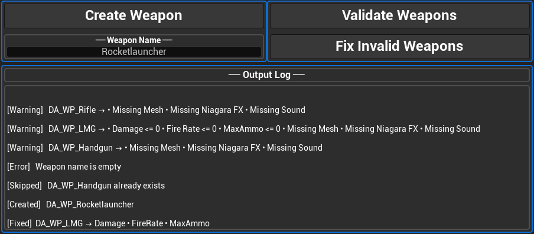

# UE5 Weapon Pipeline Tool

Editor tool built in Unreal Engine to automate weapon setup and enforce asset standards within a production pipeline.

## Features
- Automated Blueprint creation based on predefined rules
- Asset validation to ensure consistency and correct configuration
- Streamlined setup workflow for designers and artists

## Tech
- Unreal Engine 5
- Blueprint (Editor Utility Widgets)

## Tool Preview

